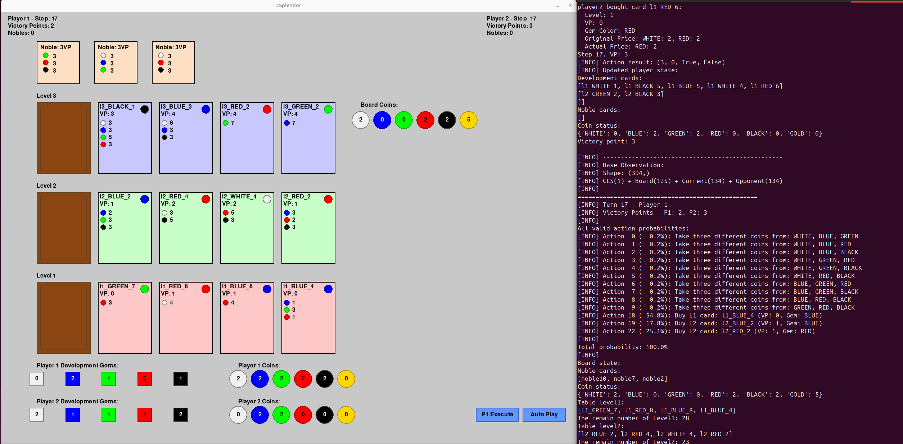

# JSplendor

[](https://opensource.org/licenses/MIT)

This repository contains a strong AI implementation using PPO (Proximal Policy Optimization), demonstrated through the Splendor board game.

If you find this repository helpful, please consider giving it a star ⭐! It helps make this project more visible to others.

## Features

Self-play training with curriculum learning.

## Installation

```bash
git clone https://github.com/yourusername/jsplendor.git
cd jsplendor
pip install -r requirements.txt
```

## Quick Start

### Training

```bash
# Train with self-play
python train_self_play.py --exp experiment_name --num_cpu 4
# Train against random opponent with step reward
python train_against_random.py --exp experiment_name --num_cpu 4
```

### Evaluation

```bash
# Evaluate models against each other
python evaluate_agents.py \
    --model1_path pretrained/linear2/model_gen_12.zip \
    --model2_path pretrained/linear2/model_gen_9.zip \
    --n_episodes 1 \
    --verbose \

# Calculate ELO ratings
python calculate_elo.py --model_dir pretrained/linear2 --n_games 200
```

## GUI Game Play

The game provides a graphical interface to watch AI agents play against each other. You can control the game flow and see the agents' decision-making process.



### Running the GUI

To start the GUI game, use:

```bash
python test_gui.py --model1_path path/to/model1 --model2_path path/to/model2 --model1_type linear --model2_type linear
```

For random players:
```bash
python test_gui.py --model1_type random --model2_type random
```

### GUI Controls

The interface provides two main control buttons at the bottom right:

1. **Show Probs / Execute Button**
   - First click: Shows action probabilities for the current player
   - Second click: Executes the selected action
   - The button color indicates the current player (blue for P1, orange for P2)

2. **Auto Play Button**
   - Toggles automatic play mode
   - When enabled, the game will automatically play moves with a 1-second delay
   - Green when active, blue when inactive

### Game Display

The GUI shows:
- Player information at the top (Victory Points, Nobles, Model type)
- Noble cards below the player info
- Development cards for each level (L3, L2, L1)
- Board coins on the right side
- Player development gems and coins on the right side below board coins
- Current player's turn indicator in the action button

### Action Probabilities

When "Show Probs" is clicked, the terminal will display:
- All valid actions for the current state
- Probability distribution over these actions
- Detailed description of each possible action
- Current game state including board and player information

For PPO models, probabilities are calculated from the model's policy. For random players, probabilities are uniformly distributed across valid actions.

## Project Structure

```
jsplendor/
├── jsplendor/
│ ├── env/
│ │ ├── env.py # Self-play environment
│ │ └── observation.py # State representation
│ ├── game/ # Core game logic
│ ├── models/ # Neural networks
│ │ ├── transformer.py # Transformer architecture (TODO: update the network architecture)
│ │ ├── linear.py # Basic linear network
│ │ └── linear2.py # Linear network with skip connections (recommended)
│ ├── policy/ # Custom policies
│ │ └── masked_policy.py # PPO policy with action masking
│ └── utils/ # Utilities and logging
├── tests/ # Test files
├── pretrained/ # Pre-trained models
│ └── linear2/ # Best performing models
├── train_against_random.py # Training against random opponent with step reward
├── train_self_play.py # Self-play training
└── evaluate_agents.py # Model evaluation
```

## Requirements

- Python 3.8+
- PyTorch
- Stable-Baselines3
- Gymnasium
- NumPy
- x-transformers

## Logging

Training and evaluation results are stored in:
- Training logs: `logs/{experiment_name}/`
