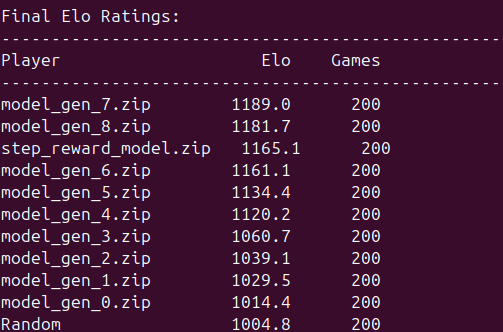

# Model Elo Ratings

This directory contains pretrained models for JSplendor and their Elo ratings.

## Elo Rating Results (2024-03-25)



### Test Configuration
- Games per match: 20 (10 games each as first/second player)
- Action selection: Stochastic (non-deterministic)
- Random player baseline: 1000 Elo
- K-factor: 32

### Interpretation
- Higher Elo indicates stronger play
- Each 400 Elo difference represents roughly a 10:1 win ratio
- Random player serves as baseline at 1000 Elo
- Models are named by their generation number during training

### Notable Observations
- [Add any interesting patterns or observations about model progression]
- [Note any particularly strong or weak generations]
- [Comment on training stability/improvement]

### Usage
To evaluate models yourself:
```bash
python calculate_elo.py --models_dir pretrained --n_games 20
```

This will generate a new Elo rating for each model.
